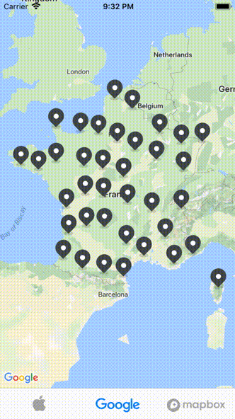
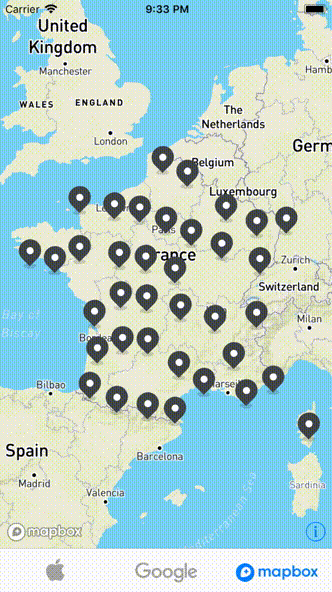

<p align="center">
  
</p>

<p align="center">
    <a href="https://travis-ci.org/hulab/ClusterKit">
        
    </a>
    <a href="http://cocoapods.org/pods/ClusterKit">
        
    </a>
    <a href="http://cocoapods.org/pods/ClusterKit">
        
    </a>
    <a href="http://cocoapods.org/pods/ClusterKit">
        
    </a>
    <a href="https://swift.org/package-manager">
        
    </a>
    <a href="https://github.com/Carthage/Carthage">
        
    </a>
</p>

----------------

ClusterKit is an elegant and efficiant clustering controller for maps. Its flexible architecture make it very customizable, you can use your own algorithm and even your own map provider. 

## Features

+ Native supports of [**MapKit**](https://developer.apple.com/documentation/mapkit), [**GoogleMaps**](https://developers.google.com/maps/documentation/ios-sdk), [**Mapbox**](https://www.mapbox.com/ios-sdk/) and [**YandexMapKit**](https://tech.yandex.com/maps/mapkit/).
+ Comes with 2 clustering algorithms, a Grid Based Algorithm and a Non Hierarchical Distance Based Algorithm.
+ Annotations are stored in a [QuadTree](https://en.wikipedia.org/wiki/Quadtree) for efficient region queries.
+ Cluster center can be switched to **Centroid**, **Nearest Centroid**, **Bottom**.
+ Handles pin **selection** as well as **drag and dropping**.
+ Written in Objective-C with full **Swift** interop support.

|MapKit|GoogleMaps|Mapbox|
|---|---|---|
||||

## Installation & Usage

**Please follow the [wiki](https://github.com/hulab/ClusterKit/wiki) for integration.**

If you want to try it, simply run:

```
pod try ClusterKit
```

Or clone the repo and run `pod install` from the [Examples](Examples) directory first.
> Provide the [Google API Key](https://console.developers.google.com) in the AppDelegate in order to try it with GoogleMaps.

> Provide the [Mapbox Access Token](https://www.mapbox.com/studio/account/tokens/) in the AppDelegate in order to try it with Mapbox.

> Provide the [Yandex API Key](https://developer.tech.yandex.ru/) in the AppDelegate in order to try it with YandexMapKit.

## Credits

Assets by [Hugo des Gayets](https://dribbble.com/hugodesgayets).

Thanks [@petropavel13](https://github.com/petropavel13) for the **YandexMapKit** integration.

## License

ClusterKit is available under the MIT license. See the [LICENSE](LICENSE) file for more info.
